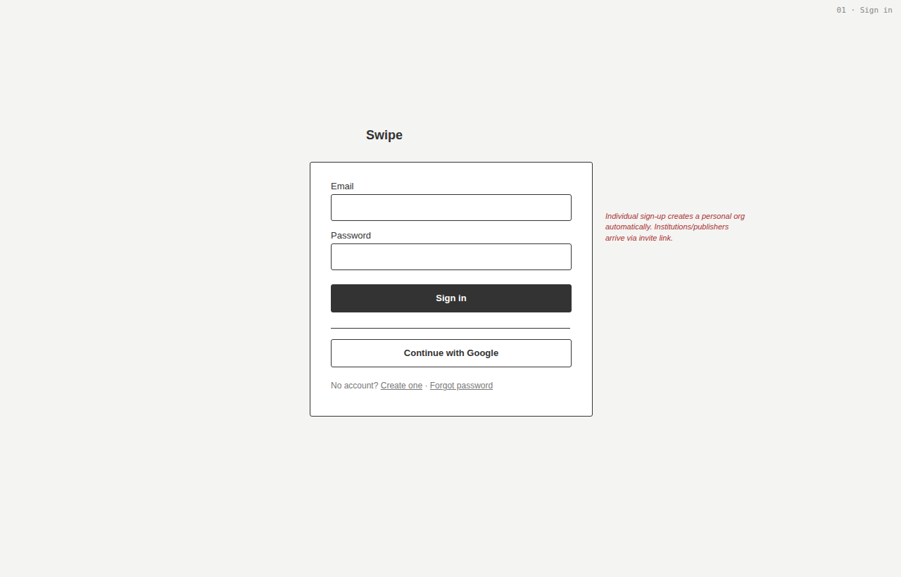
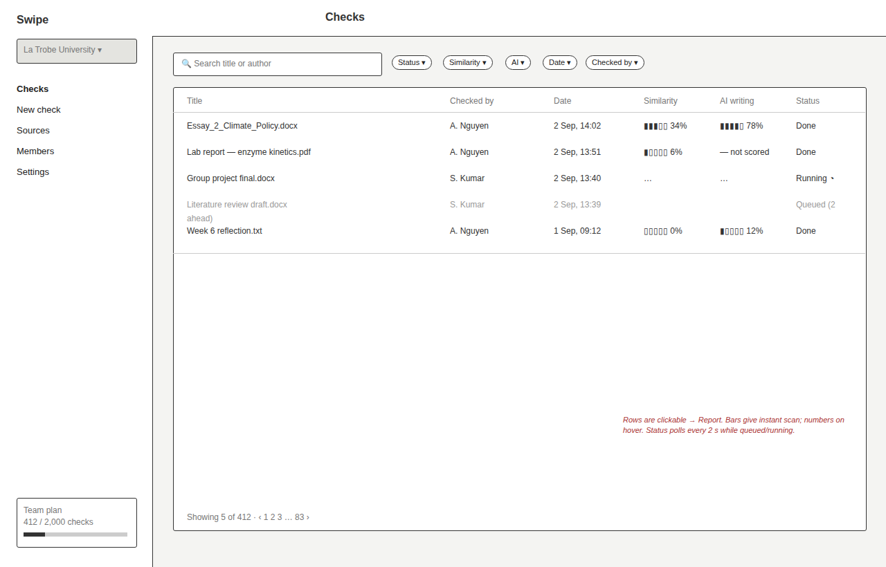
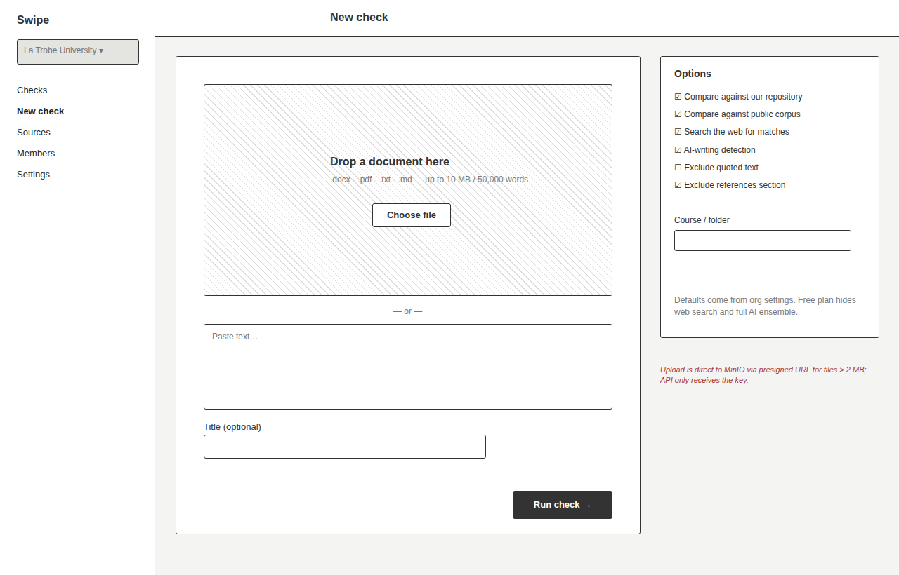
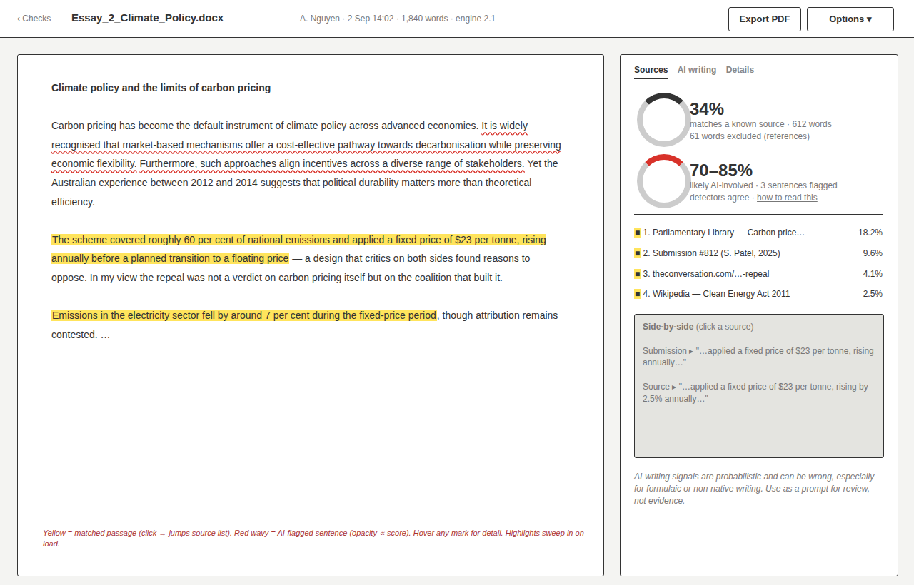
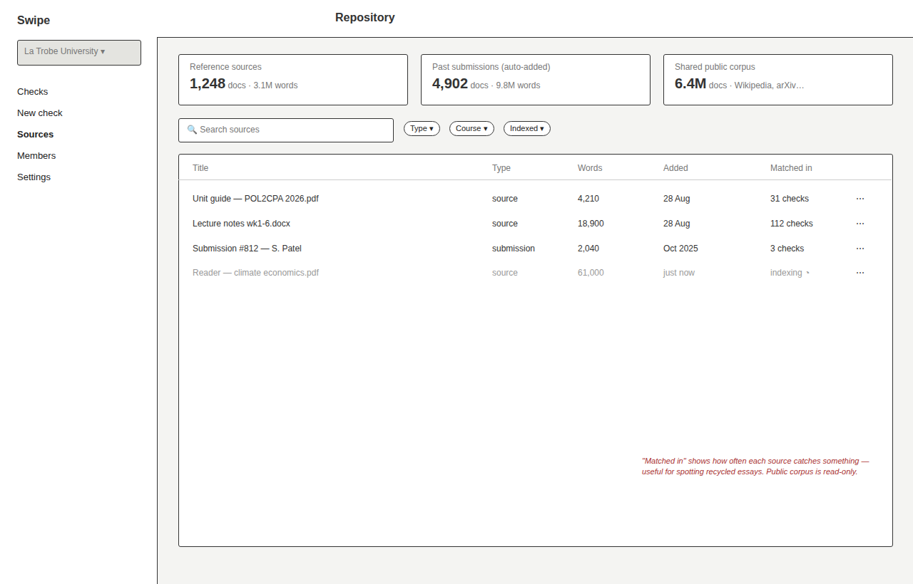
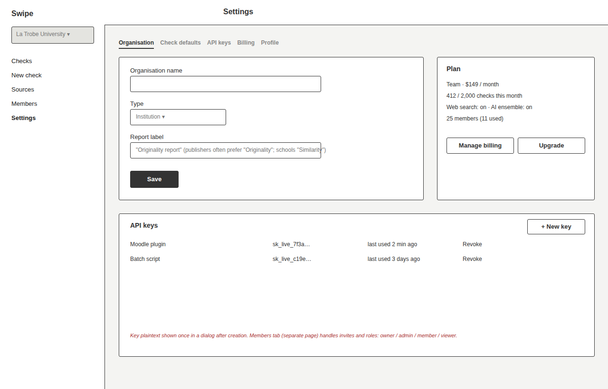

# 06 · Frontend

Vite · React 18 · TypeScript · Tailwind (own tokens) · TanStack Query · React Router · anime.js.

## Design language

| Token | Value | Use |
|---|---|---|
| desk | #E9EBEF | app background |
| page | #FFFFFF | the document sheet, panels |
| ink | #1B2230 | text |
| graphite | #6A7280 | secondary text |
| highlighter | #FFE45C | matched passages |
| redpen | #D8322A | AI-flagged sentences, errors |
| pencil | #2F5FD0 | primary actions, links |
| serif | Source Serif 4 | document body |
| sans | Public Sans | UI |

The report is the manuscript itself, annotated. Everything else is quiet chrome around it.

## Screens

### 01 · Sign in


Email/password, Google SSO. Individual sign-up auto-creates a personal org. Institution/publisher members arrive through invitation links.

### 02 · Dashboard


List of checks with scan-able bars, filters, live status for queued/running rows (polling). Sidebar shows org switcher and plan usage.

### 03 · New check


Dropzone or paste, options panel with org defaults. Large files upload direct to MinIO via presigned URL.

### 04 · Report


Document pane + margin pane with three tabs: Sources (rings, ranked list, side-by-side), AI writing (band, per-sentence heatmap, detector breakdown, caveat), Details (options used, timings, engine version). Export to PDF.

### 05 · Sources


The org's repository: reference sources, auto-added past submissions, shared public corpus (read-only). Bulk upload with indexing progress.

### 06 · Settings


Organisation, check defaults, API keys, billing (Stripe portal), profile. Members and invitations on their own page.

## Component map

```
AppShell
├── Sidebar (OrgSwitcher, Nav, PlanUsage)
├── TopBar
└── <Page>
    Dashboard      → ChecksTable (CheckRow, ScoreBar, StatusPill), Filters, Pagination
    NewCheck       → Dropzone, PasteBox, CheckOptions, SubmitBar
    Report         → ManuscriptPane (Document → Paragraph → Sentence → Highlight)
                     MarginPane (ReportTabs → SourcesTab | AiTab | DetailsTab)
                       SourcesTab → ScoreRing×2, SourceList, SourceSideBySide
                       AiTab      → ConfidenceBand, AiHeatmapLegend, DetectorBreakdown, Caveat
                     ExportButton
    Sources        → RepoStats, SourcesTable, BulkUploadDialog
    Members        → MembersTable, InviteDialog, RoleSelect
    Settings       → Tabs(OrgForm, CheckDefaultsForm, ApiKeysTable, BillingPanel, ProfileForm)
```

## Data flow

- `api/client.ts` attaches the JWT, refreshes on 401, normalises errors.
- `useCheck(id)` polls `GET /checks/{id}` every 2 s while status is queued/running, then stops.
- `ManuscriptPane` receives `payload` and derives per-word highlight and per-sentence AI maps once (memoised); spans render from those maps.
- The highlight sweep runs once on first render of a report via anime.js; disabled under `prefers-reduced-motion`.

## Accessibility

Keyboard-navigable source list (Enter jumps to first highlight), focus rings on all controls, highlights carry `title` and `aria-label` with the source name, colour is never the only signal (icons + text on bars and pills).
